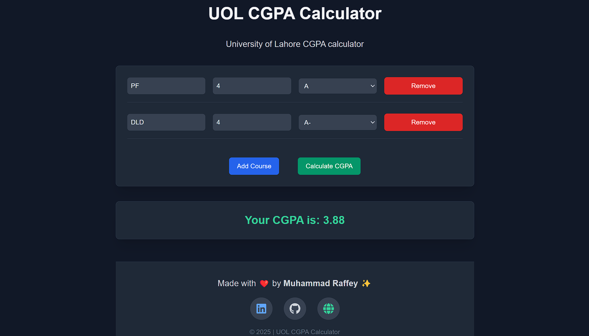

# UOL CGPA Calculator

## Overview

The **UOL CGPA Calculator** is a responsive and user-friendly React application built with Next.js. It allows students to calculate their CGPA based on their course grades and credits.

## Features

- Add multiple courses with course name, credits, and grades.
- Dynamically calculate CGPA based on input values.
- Intuitive user interface with a modern design.
- Footer section with creator details and social media links.

## Technologies Used

- **React** with **TypeScript**
- **Next.js**
- **Tailwind CSS** for styling
- **React Icons** for social media links

## Installation and Setup

### Prerequisites

Ensure you have the following installed on your system:

- Node.js (v14 or higher)
- npm or yarn

### Steps

1. Clone the repository:

   ```bash
   git clone https://github.com/MuhammadRaffey/uol-cgpa-calc
   ```

2. Navigate to the project directory:

   ```bash
   cd uol-cgpa-calc
   ```

3. Install the dependencies:

   ```bash
   pnpm install
   # or
   npm install
   # or
   yarn install
   ```

4. Run the development server:

   ```bash
   pnpm dev
   # or
   yarn dev
   # or
   npm run dev
   ```

5. Open the application in your browser:
   ```
   http://localhost:3000
   ```

## Usage

1. Enter the course name, credits, and grade for each course.
2. Add more courses by clicking the **Add Course** button.
3. Remove any unwanted courses using the **Remove** button.
4. Click **Calculate CGPA** to view the result.

## Social Links

The footer contains links to connect with the creator:

- [LinkedIn](https://linkedin.com/in/muhammad-raffey)
- [GitHub](https://github.com/MuhammadRaffey)
- [Portfolio](https://raffey-portfolio.vercel.app/)

## Screenshot



### Creator

Developed with ❤️ by [Muhammad Raffey](https://raffey-portfolio.vercel.app/).
